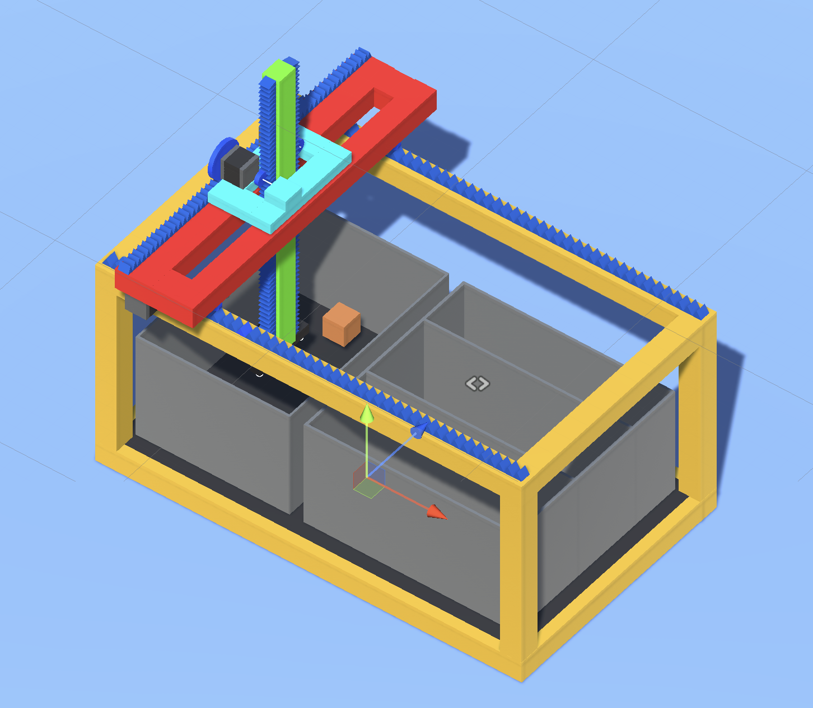
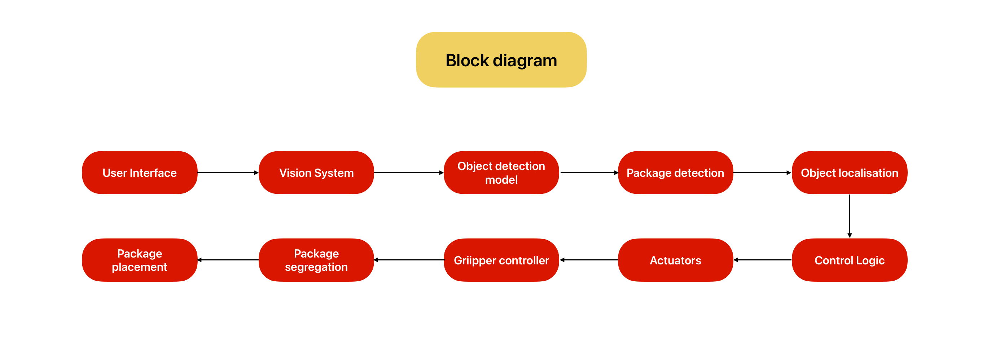
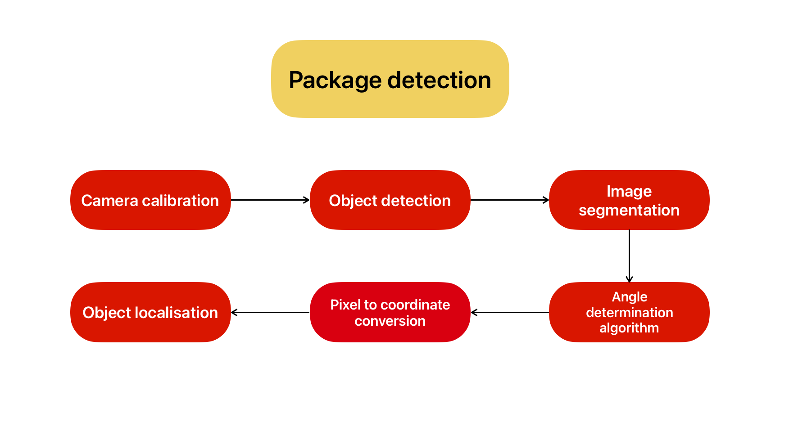
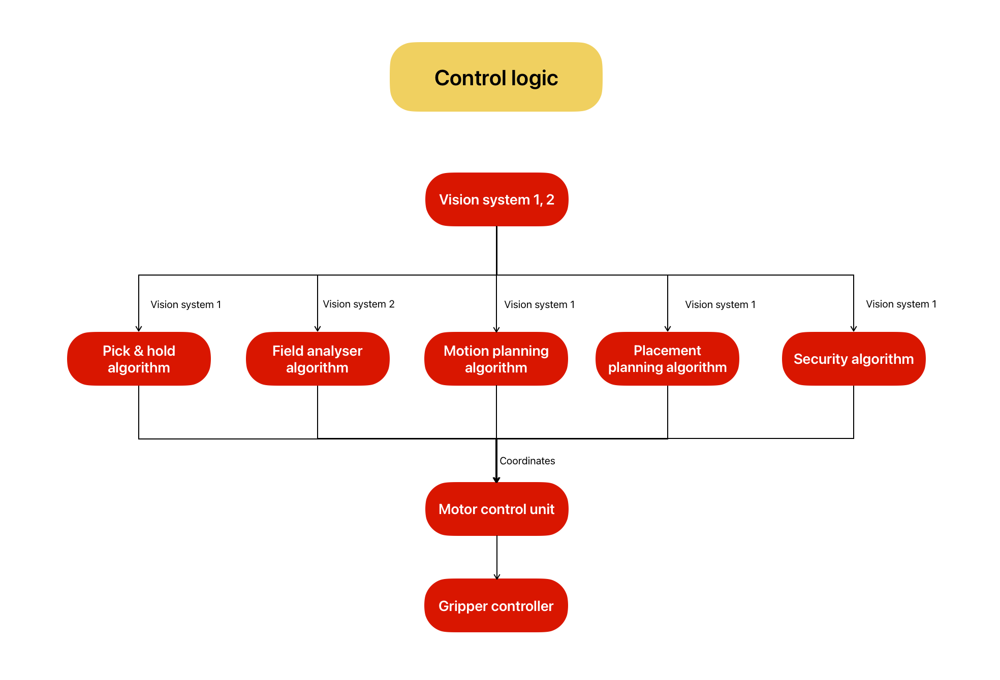
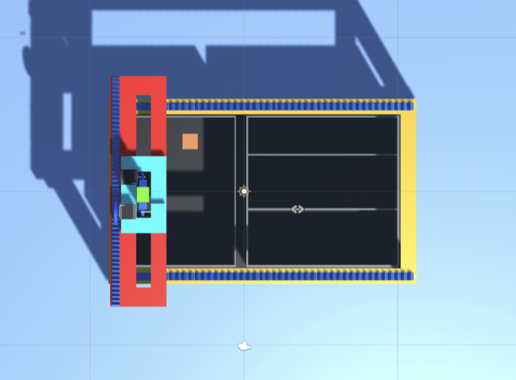
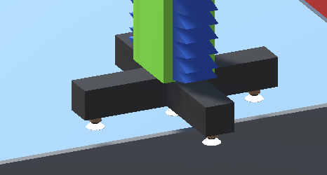
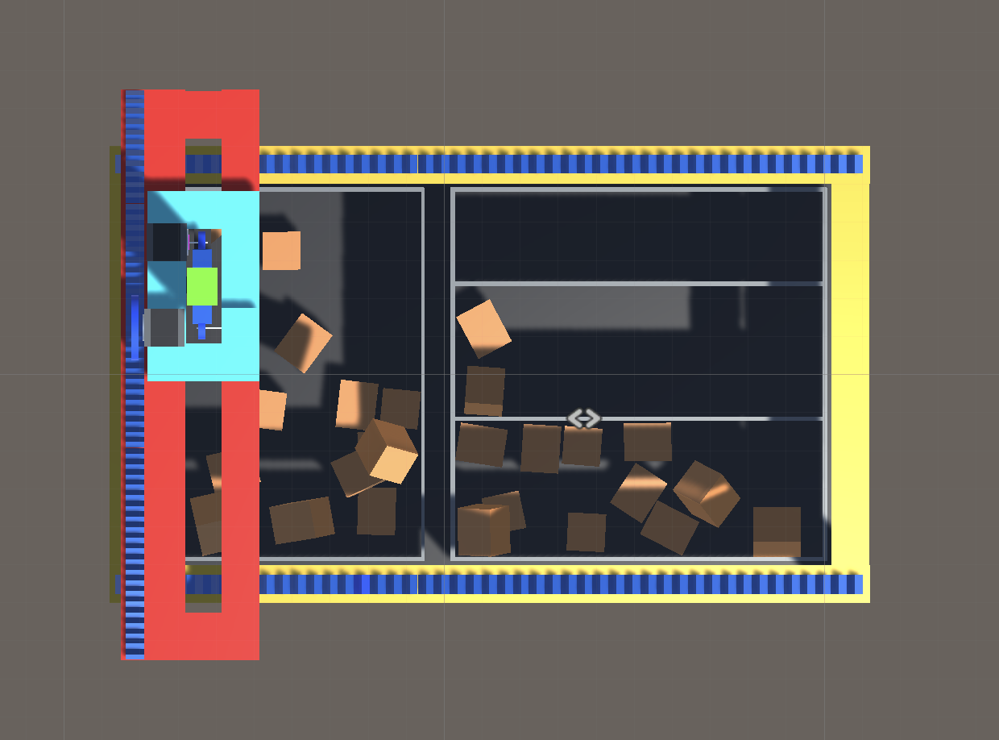

# Robotic sorting arm </h1>

The demand for accurate and efficient package sorting and handling in logistic companies or warehouses has been increasing with a tremendous pace which resulted in building 
of a new and innovative solution "Robotic sorting arm”. This project is designed such as it integrates machine learning, vision system with modern robotics to shape it as a sorting system. 
Main goal in this project is to address the necessity to revolutionise the package sorting process by increasing its efficiency, speed and accuracy.

## System Overview
The system is designed to handle packages with high accuracy and efficiency, using multiple vision systems, object detection models, and a control logic block to manage motor control units and robotic arm movements.
 

## Vision System with Object Detection
The system employs multiple vision systems, each with a YOLO v5 object detection model trained on a custom dataset of labeled images. The model achieves a mean average precision (mAP) of 95%, ensuring reliable package identification. The trained model outputs bounding boxes that precisely localize detected packages within the captured images.

## Package detection mechanism
Following successful package detection, a segregation block is used to analyze the detected packages and their corresponding bounding boxes. This block includes algorithms for classification, prioritization, and conflict resolution, generating precise coordinates for each package's location within the workspace.

  

## Control Logic 
A central control logic block receives the package coordinates from the segregation block and controls the motor control unit, directing the movements of the robotic arm with high precision. The control logic also interfaces with the gripper controller, dictating the gripper's actions to securely grasp and manipulate packages during sorting.

## Package Placement 
A dedicated package placement algorithm determines the optimal destination points within the designated drop zone for each segregated package, considering package type, size, and potential destination conflicts.

# System Architecture
The system architecture can be broken down into the following components:
1. Vision Systems: The vision systems use object detection models to detect packages and provide bounding boxes around them.
2. Segregation Mechanism: The segregation block contains multiple algorithms that use the detected packages' coordinates to localize them.
3. Control Logic Block: The control logic block uses the coordinates to control a motor control unit, which in turn controls the actuators and gripper controller of the robotic arm.

# Simulation Results
## Framework of the Robotic sorting arm

## Top-view of the Robotic sorting arm

  
  

## Gripper design

## Package segregation 

# Result
This project has successfully developed a sorting mechanism that uses a robotic arm, a vision system, and machine learning algorithms to create a progressive sorting model for package detection, segregation, and localization. This model reduces labour expenses, speeds up sorting, and saves time. We have designed and integrated complex components and modules with advanced AI models to improve package classification and localisation and adresses the challenges faced by the warehouses by developing sophicated algorithms to segregate packages with speed, accuracy which can be easily integrated with the existing infrastructure.

